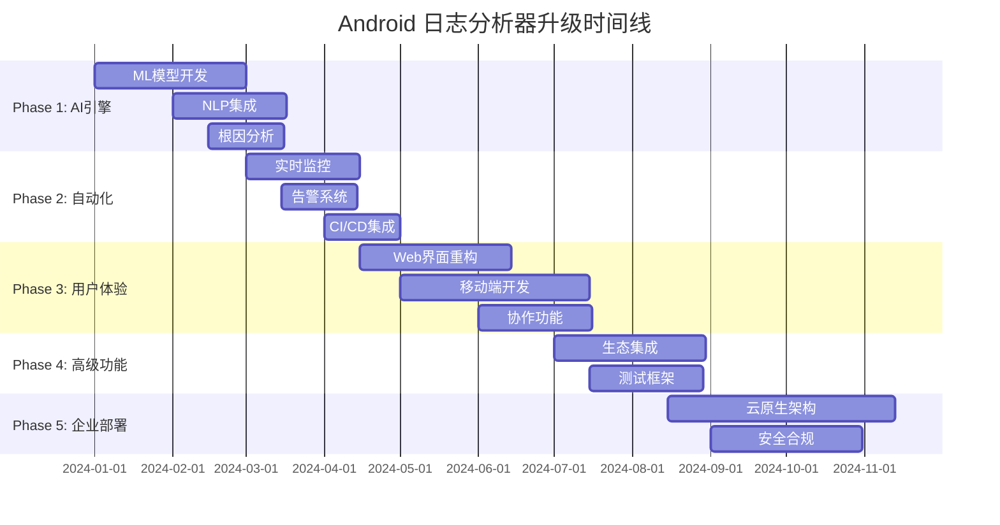

# 🚀 Android 日志分析器智能化升级计划

## 📅 项目概览
**目标**: 将 Android 日志分析器升级为智能化、自动化的企业级工具  
**时间框架**: 6-12 个月分阶段实施  
**核心理念**: AI 驱动 + 自动化 + 用户友好

## 🎯 升级目标

### 🧠 智能化分析
- **AI 驱动的问题检测**: 使用机器学习识别复杂问题模式
- **智能根因分析**: 自动追踪问题源头和关联性
- **预测性分析**: 基于历史数据预测潜在问题
- **自然语言查询**: 支持用户用自然语言查询日志

### 🔄 自动化工作流
- **实时监控**: 持续监控设备日志流
- **自动报告生成**: 定时生成分析报告
- **智能告警**: 基于严重程度的智能通知
- **自动修复建议**: 提供具体的解决方案

### 🎨 用户体验优化
- **可视化仪表板**: 直观的数据可视化
- **协作功能**: 团队共享和协作分析
- **移动端支持**: 随时随地访问分析结果
- **个性化定制**: 根据用户角色定制界面

## 📊 Phase 1: 智能分析引擎 (1-3 个月)

### 🧠 AI/ML 集成

#### 1.1 机器学习模型开发
```python
# 新增模块: android_log_analyzer/ml/
├── models/
│   ├── crash_classifier.py      # 崩溃类型分类器
│   ├── anomaly_detector.py      # 异常检测模型
│   ├── pattern_recognizer.py    # 模式识别引擎
│   └── severity_predictor.py    # 严重程度预测
├── training/
│   ├── data_preprocessor.py     # 数据预处理
│   ├── feature_extractor.py     # 特征提取
│   └── model_trainer.py         # 模型训练
└── inference/
    ├── real_time_analyzer.py    # 实时分析
    └── batch_processor.py       # 批量处理
```

#### 1.2 智能问题检测
- **深度学习崩溃分析**: 使用 LSTM/Transformer 分析崩溃序列
- **异常行为检测**: 基于统计学习的异常检测
- **关联性分析**: 发现不同子系统间的问题关联
- **时间序列分析**: 识别周期性和趋势性问题

#### 1.3 自然语言处理
```python
# 功能实现
class NLPQueryEngine:
    def process_query(self, query: str) -> AnalysisResult:
        """
        支持查询如:
        - "显示昨天的所有崩溃"
        - "找出内存相关的问题"
        - "分析音频子系统的异常"
        """
        pass
```

### 🔍 高级分析功能

#### 1.4 根因分析引擎
```python
class RootCauseAnalyzer:
    def analyze_crash_chain(self, issues: List[Issue]) -> CausalChain:
        """分析问题的因果链"""
        pass
    
    def find_common_patterns(self, logs: List[LogFile]) -> List[Pattern]:
        """发现常见问题模式"""
        pass
```

#### 1.5 预测性分析
- **故障预测**: 基于历史数据预测可能的故障
- **性能趋势**: 分析性能指标的变化趋势
- **资源使用预测**: 预测内存、CPU 使用情况

## 🔄 Phase 2: 自动化与实时监控 (3-5 个月)

### 📡 实时监控系统

#### 2.1 实时日志流处理
```python
# 新增模块: android_log_analyzer/streaming/
├── collectors/
│   ├── adb_collector.py         # ADB 日志收集
│   ├── network_collector.py     # 网络日志收集
│   └── file_watcher.py          # 文件监控
├── processors/
│   ├── stream_processor.py      # 流处理引擎
│   ├── real_time_analyzer.py    # 实时分析
│   └── alert_manager.py         # 告警管理
└── storage/
    ├── time_series_db.py        # 时序数据库
    └── log_indexer.py           # 日志索引
```

#### 2.2 智能告警系统
```python
class IntelligentAlertSystem:
    def configure_rules(self, rules: List[AlertRule]):
        """配置告警规则"""
        pass
    
    def send_smart_notification(self, issue: Issue, context: Context):
        """发送智能通知"""
        # 支持: 邮件、Slack、微信、钉钉
        pass
```

#### 2.3 自动化工作流
- **定时分析**: 自动定时分析日志文件
- **报告生成**: 自动生成日报、周报、月报
- **数据备份**: 自动备份重要日志数据
- **清理策略**: 智能清理过期数据

### 🔧 DevOps 集成

#### 2.4 CI/CD 集成
```yaml
# .github/workflows/log-analysis.yml
name: Automated Log Analysis
on:
  schedule:
    - cron: '0 */6 * * *'  # 每6小时运行一次
jobs:
  analyze-logs:
    runs-on: ubuntu-latest
    steps:
      - name: Collect Device Logs
        run: android-log-analyzer --auto-collect
      - name: Generate Report
        run: android-log-analyzer --auto-report
      - name: Send Notifications
        run: android-log-analyzer --notify-teams
```

#### 2.5 云平台集成
- **AWS/Azure/GCP**: 云端日志分析服务
- **Docker 容器化**: 便于部署和扩展
- **Kubernetes 编排**: 大规模部署管理
- **API 服务**: RESTful API 供其他系统调用

## 🎨 Phase 3: 用户体验革命 (4-6 个月)

### 📊 可视化仪表板

#### 3.1 现代化 Web 界面
```typescript
// 新增前端技术栈
├── frontend/                    # React/Vue.js 前端
│   ├── components/
│   │   ├── Dashboard.tsx        # 主仪表板
│   │   ├── LogViewer.tsx        # 日志查看器
│   │   ├── AnalysisChart.tsx    # 分析图表
│   │   └── AlertPanel.tsx       # 告警面板
│   ├── services/
│   │   ├── api.ts               # API 服务
│   │   └── websocket.ts         # 实时通信
│   └── utils/
│       ├── chartUtils.ts        # 图表工具
│       └── dataProcessor.ts     # 数据处理
```

#### 3.2 交互式数据可视化
- **实时图表**: 使用 D3.js/Chart.js 的动态图表
- **热力图**: 显示问题分布和频率
- **时间线视图**: 交互式事件时间线
- **3D 可视化**: 复杂数据关系的 3D 展示

#### 3.3 智能仪表板
```python
class SmartDashboard:
    def generate_insights(self, user_role: str) -> List[Insight]:
        """根据用户角色生成个性化洞察"""
        pass
    
    def recommend_actions(self, current_state: SystemState) -> List[Action]:
        """推荐操作建议"""
        pass
```

### 📱 移动端应用

#### 3.4 移动应用开发
```dart
// Flutter 移动应用
├── mobile_app/
│   ├── lib/
│   │   ├── screens/
│   │   │   ├── dashboard_screen.dart
│   │   │   ├── alerts_screen.dart
│   │   │   └── reports_screen.dart
│   │   ├── services/
│   │   │   ├── api_service.dart
│   │   │   └── notification_service.dart
│   │   └── widgets/
│   │       ├── chart_widget.dart
│   │       └── log_item_widget.dart
```

#### 3.5 移动端功能
- **推送通知**: 重要问题的即时通知
- **离线查看**: 缓存重要数据供离线查看
- **语音查询**: 语音输入查询日志
- **AR 可视化**: 增强现实的数据展示

### 🤝 协作功能

#### 3.6 团队协作平台
```python
class CollaborationPlatform:
    def share_analysis(self, analysis: Analysis, team: Team):
        """分享分析结果"""
        pass
    
    def create_discussion(self, issue: Issue) -> Discussion:
        """创建问题讨论"""
        pass
    
    def assign_task(self, issue: Issue, assignee: User):
        """分配任务"""
        pass
```

#### 3.7 知识管理
- **问题库**: 构建问题解决方案知识库
- **最佳实践**: 分享团队最佳实践
- **培训模块**: 内置培训和学习资源
- **专家系统**: 连接领域专家

## 🔧 Phase 4: 高级功能与集成 (5-8 个月)

### 🔌 生态系统集成

#### 4.1 开发工具集成
```python
# IDE 插件开发
├── ide_plugins/
│   ├── vscode/                  # VS Code 插件
│   ├── android_studio/          # Android Studio 插件
│   └── intellij/                # IntelliJ 插件
```

#### 4.2 第三方工具集成
- **Jira/Trello**: 自动创建问题票据
- **Slack/Teams**: 团队通信集成
- **Jenkins/GitLab CI**: 构建流程集成
- **Grafana/Kibana**: 监控平台集成

### 🧪 测试与质量保证

#### 4.3 自动化测试框架
```python
class AutomatedTestFramework:
    def generate_test_cases(self, log_patterns: List[Pattern]) -> List[TestCase]:
        """基于日志模式生成测试用例"""
        pass
    
    def validate_fixes(self, issue: Issue, fix: Fix) -> ValidationResult:
        """验证修复效果"""
        pass
```

#### 4.4 质量度量
- **代码质量评分**: 基于日志分析的代码质量评估
- **稳定性指标**: 应用稳定性量化指标
- **性能基准**: 性能基准测试和比较
- **回归检测**: 自动检测性能回归

## 🌐 Phase 5: 企业级部署 (6-12 个月)

### ☁️ 云原生架构

#### 5.1 微服务架构
```yaml
# docker-compose.yml
version: '3.8'
services:
  log-collector:
    image: android-analyzer/collector:latest
  analysis-engine:
    image: android-analyzer/engine:latest
  ml-service:
    image: android-analyzer/ml:latest
  web-ui:
    image: android-analyzer/web:latest
  api-gateway:
    image: android-analyzer/gateway:latest
```

#### 5.2 可扩展性设计
- **水平扩展**: 支持多实例部署
- **负载均衡**: 智能负载分配
- **缓存策略**: 多层缓存优化
- **数据分片**: 大数据分片存储

### 🔒 安全与合规

#### 5.3 安全框架
```python
class SecurityFramework:
    def encrypt_logs(self, logs: List[LogEntry]) -> List[EncryptedLog]:
        """日志加密"""
        pass
    
    def audit_access(self, user: User, action: Action):
        """访问审计"""
        pass
    
    def anonymize_data(self, logs: List[LogEntry]) -> List[LogEntry]:
        """数据脱敏"""
        pass
```

#### 5.4 合规性支持
- **GDPR 合规**: 数据隐私保护
- **SOX 合规**: 审计跟踪
- **ISO 27001**: 信息安全管理
- **数据本地化**: 支持数据本地存储

## 📈 技术实现路线图

### 🛠️ 技术栈升级

#### 核心技术
```python
# 新增依赖
requirements_ai.txt:
- tensorflow>=2.13.0
- pytorch>=2.0.0
- scikit-learn>=1.3.0
- transformers>=4.30.0
- spacy>=3.6.0

requirements_streaming.txt:
- apache-kafka>=3.5.0
- redis>=4.6.0
- elasticsearch>=8.8.0
- influxdb>=1.8.0

requirements_web.txt:
- fastapi>=0.100.0
- websockets>=11.0.0
- celery>=5.3.0
- gunicorn>=21.0.0
```

#### 前端技术
```json
{
  "dependencies": {
    "react": "^18.2.0",
    "typescript": "^5.1.0",
    "d3": "^7.8.0",
    "three": "^0.154.0",
    "socket.io-client": "^4.7.0",
    "antd": "^5.7.0"
  }
}
```

### 📊 性能目标

| 指标 | 当前 | 目标 | 提升 |
|------|------|------|------|
| 分析速度 | 1MB/s | 10MB/s | 10x |
| 问题检测准确率 | 85% | 95% | +10% |
| 误报率 | 15% | 5% | -10% |
| 响应时间 | 5s | 1s | 5x |
| 并发用户 | 10 | 1000 | 100x |

## 💰 投资与资源规划

### 👥 团队配置
- **AI/ML 工程师**: 2-3 人
- **后端开发工程师**: 3-4 人
- **前端开发工程师**: 2-3 人
- **移动端开发工程师**: 1-2 人
- **DevOps 工程师**: 1-2 人
- **产品经理**: 1 人
- **UI/UX 设计师**: 1 人

### 💻 基础设施
- **云服务器**: AWS/Azure/GCP
- **GPU 计算**: ML 模型训练
- **存储服务**: 大数据存储
- **CDN 服务**: 全球内容分发
- **监控服务**: 系统监控

### 📅 时间规划


## 🎯 成功指标

### 📊 量化指标
- **用户满意度**: >90%
- **问题检测准确率**: >95%
- **分析速度提升**: 10x
- **用户采用率**: >80%
- **系统可用性**: >99.9%

### 🏆 业务价值
- **开发效率提升**: 50%
- **问题解决时间缩短**: 70%
- **质量问题减少**: 60%
- **团队协作效率**: 40%
- **运维成本降低**: 30%

## 🚀 立即可实施的快速改进

### 🎯 Phase 0: 快速胜利 (2-4 周)

#### 0.1 智能搜索增强
```python
# 新增文件: android_log_analyzer/search/smart_search.py
class SmartSearchEngine:
    def __init__(self):
        self.patterns = {
            'crash': ['crash', 'exception', 'fatal', 'abort'],
            'memory': ['oom', 'memory', 'gc', 'heap'],
            'performance': ['slow', 'lag', 'timeout', 'delay'],
            'network': ['network', 'connection', 'socket', 'http']
        }

    def smart_search(self, query: str, logs: List[str]) -> List[SearchResult]:
        """智能搜索，支持模糊匹配和语义搜索"""
        # 实现智能搜索逻辑
        pass

    def suggest_queries(self, partial_query: str) -> List[str]:
        """查询建议"""
        pass
```

#### 0.2 问题优先级评分
```python
class IssuePriorityScorer:
    def calculate_priority(self, issue: Issue) -> Priority:
        """基于多个因素计算问题优先级"""
        score = 0

        # 严重程度权重
        severity_weights = {'critical': 100, 'high': 75, 'medium': 50, 'low': 25}
        score += severity_weights.get(issue.severity, 25)

        # 频率权重
        if issue.frequency > 10:
            score += 50
        elif issue.frequency > 5:
            score += 25

        # 影响范围权重
        if issue.affects_system_stability:
            score += 75

        return Priority.from_score(score)
```

#### 0.3 自动化报告模板
```python
class ReportGenerator:
    def generate_executive_summary(self, analysis: Analysis) -> str:
        """生成执行摘要"""
        template = """
        # 日志分析执行摘要

        ## 关键指标
        - 总问题数: {total_issues}
        - 严重问题: {critical_issues}
        - 系统稳定性: {stability_score}%

        ## 主要发现
        {key_findings}

        ## 建议行动
        {recommendations}
        """
        return template.format(**analysis.to_dict())
```

### 🔧 Phase 0.5: 用户体验改进 (3-6 周)

#### 0.4 增强的 GUI 功能
```javascript
// 新增文件: log_analyzer_gui/web/enhanced_features.js
class EnhancedLogViewer {
    constructor() {
        this.filters = new FilterManager();
        this.highlighter = new SyntaxHighlighter();
        this.bookmarks = new BookmarkManager();
    }

    // 实时过滤
    applyRealTimeFilter(filterCriteria) {
        // 实现实时过滤逻辑
    }

    // 语法高亮
    highlightLogEntry(entry) {
        // 根据日志类型应用语法高亮
    }

    // 书签功能
    addBookmark(lineNumber, note) {
        // 添加书签和注释
    }
}
```

#### 0.5 快捷操作面板
```html
<!-- 新增快捷操作面板 -->
<div class="quick-actions-panel">
    <button onclick="findCrashes()">🔍 查找崩溃</button>
    <button onclick="analyzePerformance()">⚡ 性能分析</button>
    <button onclick="exportReport()">📊 导出报告</button>
    <button onclick="shareAnalysis()">🔗 分享分析</button>
</div>
```

## 🛠️ 具体实现指南

### 📋 开发优先级矩阵

| 功能 | 影响力 | 实现难度 | 优先级 | 预计时间 |
|------|--------|----------|--------|----------|
| 智能搜索 | 高 | 低 | P0 | 1 周 |
| 问题优先级 | 高 | 低 | P0 | 1 周 |
| 报告模板 | 中 | 低 | P1 | 2 周 |
| GUI 增强 | 高 | 中 | P1 | 3 周 |
| 实时监控 | 高 | 高 | P2 | 6 周 |
| AI 模型 | 高 | 高 | P2 | 8 周 |

### 🎯 MVP 功能列表

#### 第一个月目标
1. **智能搜索引擎** - 支持自然语言查询
2. **问题优先级评分** - 自动评估问题重要性
3. **增强的过滤器** - 多维度过滤功能
4. **快速操作面板** - 常用功能快捷访问
5. **基础报告模板** - 标准化报告格式

#### 第二个月目标
1. **实时日志监控** - 监控活动设备
2. **告警系统** - 关键问题自动通知
3. **数据可视化** - 图表和趋势分析
4. **协作功能** - 团队共享和注释
5. **移动端原型** - 基础移动访问

#### 第三个月目标
1. **机器学习模型** - 异常检测和分类
2. **预测分析** - 问题趋势预测
3. **自动化工作流** - 定时任务和报告
4. **API 接口** - 第三方集成支持
5. **性能优化** - 大文件处理优化

## 💡 创新功能概念

### 🤖 AI 助手
```python
class LogAnalysisAssistant:
    def __init__(self):
        self.knowledge_base = KnowledgeBase()
        self.nlp_processor = NLPProcessor()

    def answer_question(self, question: str, context: LogContext) -> str:
        """回答用户关于日志的问题"""
        # 示例问题:
        # "为什么应用会崩溃？"
        # "这个错误通常是什么原因？"
        # "如何修复这个问题？"
        pass

    def suggest_investigation(self, issue: Issue) -> List[InvestigationStep]:
        """建议调查步骤"""
        pass
```

### 📊 智能仪表板
```python
class IntelligentDashboard:
    def generate_insights(self, timeframe: str) -> List[Insight]:
        """生成智能洞察"""
        insights = []

        # 趋势分析
        trends = self.analyze_trends(timeframe)
        insights.extend(trends)

        # 异常检测
        anomalies = self.detect_anomalies(timeframe)
        insights.extend(anomalies)

        # 性能建议
        recommendations = self.generate_recommendations()
        insights.extend(recommendations)

        return insights
```

### 🔮 预测性维护
```python
class PredictiveMaintenance:
    def predict_failures(self, historical_data: List[LogData]) -> List[Prediction]:
        """预测可能的故障"""
        # 使用时间序列分析和机器学习
        # 预测未来可能出现的问题
        pass

    def recommend_preventive_actions(self, predictions: List[Prediction]) -> List[Action]:
        """推荐预防性措施"""
        pass
```

## 🎨 用户界面设计概念

### 🖥️ 现代化界面设计
```css
/* 新的设计系统 */
:root {
    --primary-color: #2563eb;
    --secondary-color: #64748b;
    --success-color: #10b981;
    --warning-color: #f59e0b;
    --error-color: #ef4444;
    --gradient-primary: linear-gradient(135deg, #667eea 0%, #764ba2 100%);
}

.dashboard-grid {
    display: grid;
    grid-template-columns: 1fr 2fr 1fr;
    grid-template-rows: auto 1fr auto;
    gap: 1rem;
    height: 100vh;
}

.insight-card {
    background: white;
    border-radius: 12px;
    box-shadow: 0 4px 6px -1px rgba(0, 0, 0, 0.1);
    padding: 1.5rem;
    transition: transform 0.2s ease;
}

.insight-card:hover {
    transform: translateY(-2px);
    box-shadow: 0 8px 25px -5px rgba(0, 0, 0, 0.1);
}
```

### 📱 响应式设计
```scss
// 移动端优先设计
.log-viewer {
    @media (max-width: 768px) {
        .sidebar {
            transform: translateX(-100%);
            transition: transform 0.3s ease;

            &.open {
                transform: translateX(0);
            }
        }

        .main-content {
            margin-left: 0;
        }
    }
}
```

## 🔄 持续改进框架

### 📈 用户反馈循环
```python
class FeedbackSystem:
    def collect_usage_analytics(self):
        """收集使用分析数据"""
        pass

    def analyze_user_behavior(self):
        """分析用户行为模式"""
        pass

    def generate_improvement_suggestions(self):
        """生成改进建议"""
        pass
```

### 🧪 A/B 测试框架
```python
class ABTestFramework:
    def create_experiment(self, feature: str, variants: List[str]):
        """创建 A/B 测试实验"""
        pass

    def track_metrics(self, user_id: str, action: str):
        """跟踪指标"""
        pass

    def analyze_results(self, experiment_id: str):
        """分析测试结果"""
        pass
```

---

这个全面的升级计划将把 Android 日志分析器转变为一个智能化、自动化的企业级平台。通过分阶段实施，我们可以持续为用户提供价值，同时逐步构建更强大的功能。

**下一步行动**:
1. 选择 Phase 0 的快速改进开始实施
2. 建立开发团队和技术栈
3. 设置项目管理和跟踪系统
4. 开始用户需求调研和反馈收集
